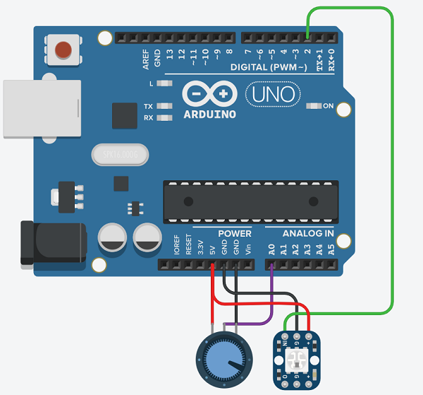

# Arduino Moisture Gauge
This is a quick sample Arduino sketch that reads from an analog moisture sensor and changes the color of a single NeoPixel from red to green to blue based on the moisture level. 

## Description
Analog readings are taken from a sensor that  transitions a NeoPixel between colors based on the reading. Red is at full with no voltage and slowly dims as voltage increases approaching a set dry threshold. At the dry threshold the red is off and the green begins to light up and reaches full brightness halfway between the dry and wet threshold before dimming again as the voltage appraoches the wet threshold. At the wet threshold the blue light begins to light up until it reaches full brightness at full voltage or zero resistance.

To ensure an LED is always on to indicate the device is operable, the red and blue have an adjustable cross-fade such that they are still minimally on at the thresholds.

## Setup

1. Download the repository and open the sketch in your favorite Arduino IDE. Compiler, makefiles etc. not included so you'll need to load this in an IDE setup for Arduino use.
2. Adjust wet and dry threshold to adjust for different intended soil moistures
3. Adjust crossfade to adjust how much the dry and wet ranges overlap the ideal range

## Tested Boards
Arduino Uno/Nano

## Try It
[TinkerCad Sample](https://www.tinkercad.com/things/1YMQJSG3po6)

